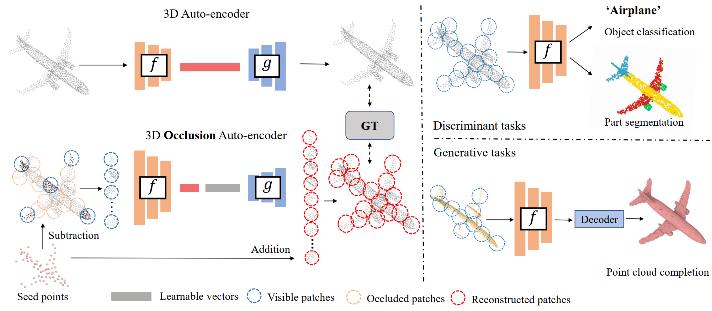
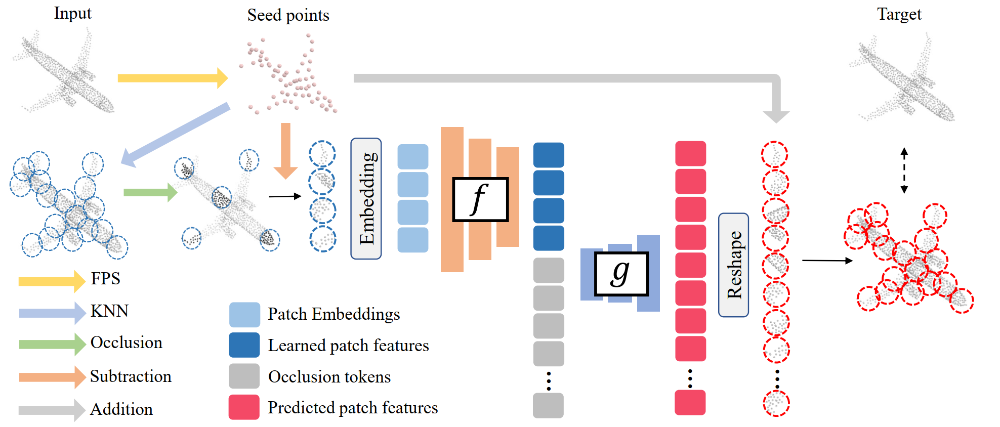
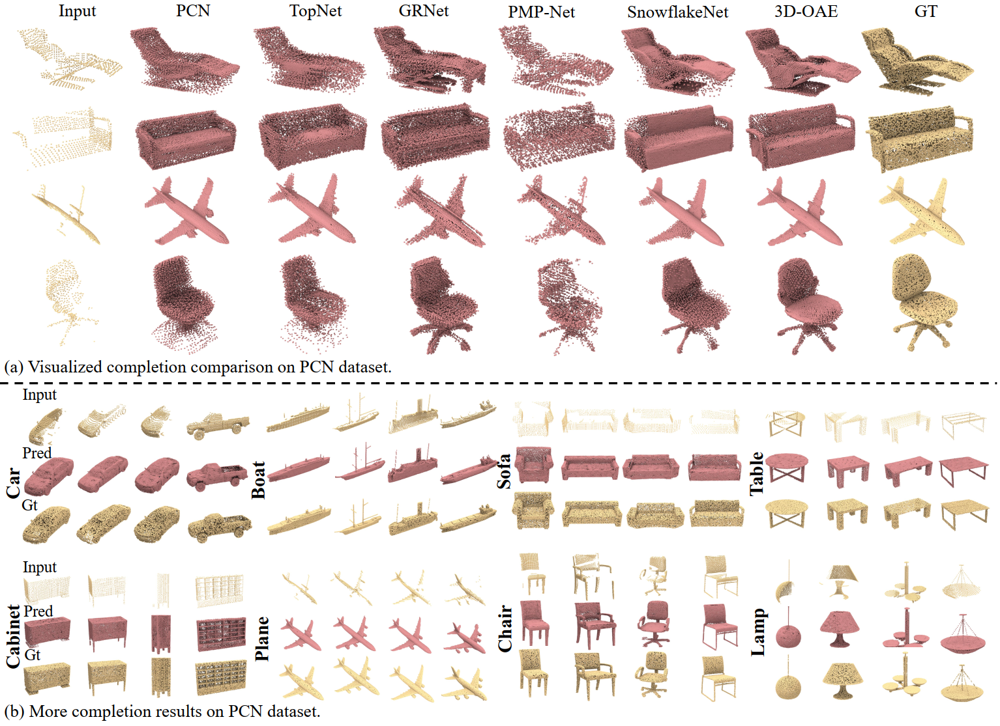

# Self-Supervised Point Cloud Representation Learning with Occlusion Auto-Encoder

Created by [Junsheng Zhou](https://junshengzhou.github.io/), [Xin Wen](https://scholar.google.com/citations?user=7gcGzs8AAAAJ&hl=zh-CN&oi=ao), [Baorui Ma](https://mabaorui.github.io/), [Yu-Shen Liu](https://yushen-liu.github.io/), [Yue Gao](https://www.gaoyue.org/), [Yi Fang](http://mmvc.engineering.nyu.edu/), [Zhizhong Han](https://h312h.github.io/)

[[arXiv]](https://arxiv.org/pdf/2203.14084.pdf) [[Project Page]](https://junshengzhou.github.io/3D-OAE/) [[Models]](#pretrained-models)

This repository contains official PyTorch implementation for __Self-Supervised Point Cloud Representation Learning with Occlusion Auto-Encoder__.



We present a novel self-supervised point cloud representation learning framework, named 3D Occlusion Auto-Encoder (3D-OAE). Our key idea is to randomly occlude some local patches of the input point cloud and establish the supervision via recovering the occluded patches using the remaining visible ones. Specifically, we design an encoder for learning the features of visible local patches, and a decoder for leveraging these features to predict the occluded patches. In contrast to previous methods, our 3D-OAE can remove a large proportion of patches and predict them only with a small number of visible patches, which enable us to significantly accelerate training and yield a nontrivial self-supervisory performance. The trained encoder can be further transferred to various downstream tasks. We demonstrate our superior performances over the state-of-the-art methods in different discriminant and generative applications under widely used benchmarks.



We first extract seed points from the input point cloud using FPS, and then separate the input into point patches by grouping local points around each seed point using KNN. After that, we randomly occlude high ratio of patches and subtract each visible patch to its corresponding seed point for detaching the patch from its spatial location. The encoder operates only on the embeddings of visible patches and the learnable occlusion tokens are combined to the latent feature before the decoder . Finally, we operate addition to the output patches and their corresponding seed points to regain their spatial locations and further merge the local patches into a complete shape, where we compute a loss function with the ground truth.

## Pretrained Models
|Model| Dataset  | Task | Performance | Config | Url|
| :---:| :---: | :---: |  :---: | :---: | :---: |
| 3D-OAE (SSL) | ShapeNet | Linear-SVM | 92.3 (Acc.) | [config](cfgs/SSL_models/Point-OAE_2k.yaml) | [Google Drive](https://drive.google.com/file/d/1_s4mi-oKY21nOG7c9ZgNuwNJwH_2QfS_/view?usp=sharing) |
| Transformer/PoinTr | PCN |Point Cloud Completion| 6.97 (CD.)| [config](cfgs/PCN_models/Transformer_pcn.yaml)| [Google Drive](https://drive.google.com/file/d/1gCud4WI_zhVkuCXCIbiyKK4wx2yso66H/view?usp=sharing) | 
| Transformer| ModelNet | Classification | 93.4 (Acc.)|  [config](cfgs/ModelNet_models/Transformer_1k.yaml) | [Google Drive](https://drive.google.com/file/d/1LIyayrmyCppBu8jmVmA69bAhDWelASnw/view?usp=sharing) |
| Transformer| ScanObjectNN |Classification| 89.16 (Acc.) | [config](cfgs/ScanObjectNN_models/Transformer_objectbg.yaml) | [Google Drive](https://drive.google.com/file/d/15XTQEf-DthrqLAE9RUAF-hDhs2RShMv_/view?usp=sharing) |
| Transformer| ScanObjectNN |Classification| 88.64 (Acc.) | [config](cfgs/ScanObjectNN_models/Transformer_objectonly.yaml) | [Google Drive](https://drive.google.com/file/d/1QQPj45-VV4WIktxscIqEuT5YVdxSgKX5/view?usp=sharing) |
| Transformer| ScanObjectNN |Classification| 83.17 (Acc.) | [config](cfgs/ScanObjectNN_models/Transformer_hardest.yaml) | [Google Drive](https://drive.google.com/file/d/1iLg0Gi1jzf7yktWoc5w_e9p4tBj9FEaE/view?usp=sharing) |
| Transformer| ShapeNetPart |Part Segmentation| 85.7 (Acc.) | [config](cfgs/ShapeNetPart_models/Transformer_seg.yaml) | [Google Drive](https://drive.google.com/file/d/1vdxFZmHbwucjdILmPftqO7YlUuIW70Er/view?usp=sharing) |


## Usage

### Requirements

- PyTorch >= 1.7.0
- python >= 3.7
- CUDA >= 9.0
- GCC >= 4.9 
- torchvision
- timm
- open3d
- tensorboardX

```
pip install -r requirements.txt
```

#### Building Pytorch Extensions for Chamfer Distance, PointNet++ and kNN

*NOTE:* PyTorch >= 1.7 and GCC >= 4.9 are required.

```
# Chamfer Distance
bash install.sh
# PointNet++
pip install "git+git://github.com/erikwijmans/Pointnet2_PyTorch.git#egg=pointnet2_ops&subdirectory=pointnet2_ops_lib"
# GPU kNN
pip install --upgrade https://github.com/unlimblue/KNN_CUDA/releases/download/0.2/KNN_CUDA-0.2-py3-none-any.whl
```

### Dataset

We use **ShapeNet** for the self-supervised learning of 3D-OAE models. And finetuning the 3D-OAE models on **ModelNet**, **ScanObjectNN**, **PCN** and **ShapeNetPart**

The details of used datasets can be found in [DATASET.md](./DATASET.md).

### Self-supervised learning
For self-supervised learning of 3D-OAE models on ShapeNet, simply run:
```
bash ./scripts/run_OAE.sh <NUM_GPU> \
    --config cfgs/SSL_models/Point-OAE_2k.yaml \
    --exp_name <name> \
    --val_freq 1
```
*val_freq* controls the frequence to evaluate the Transformer on ModelNet40 with LinearSVM.

### Fine-tuning on downstream tasks
We finetune our 3D-OAE on 6 downstream tasks: LinearSVM on ModelNet40, Classfication on ModelNet40, Few-shot learning on ModelNet40, Point completion on PCN dataset, Transfer learning on ScanObjectNN and Part segmentation on ShapeNetPart.

#### ModelNet40
To finetune a pre-trained 3D-OAE model on ModelNet40, simply run:
```
bash ./scripts/run_OAE.sh <GPU_IDS> \
    --config cfgs/ModelNet_models/Transformer_1k.yaml \
    --finetune_model \
    --ckpts <path> \
    --exp_name <name>
```

#### Few-shot Learning on ModelNet40
First, preparing the few-shot learning split and dataset. (see [DATASET.md](./DATASET.md)). Then run:
```
bash ./scripts/run_OAE.sh <GPU_IDS> \
    --config cfgs/Fewshot_models/Transformer_1k.yaml \
    --finetune_model \
    --ckpts <path> \
    --exp_name <name> \
    --way <int> \
    --shot <int> \
    --fold <int>
```

#### ScanObjectNN
To finetune a pre-trained 3D-OAE model on ScanObjectNN, simply run:
```
bash ./scripts/run_OAE.sh <GPU_IDS>  \
    --config cfgs/ScanObjectNN_models/Transformer_hardest.yaml \
    --finetune_model \
    --ckpts <path> \
    --exp_name <name>
```

#### Point Cloud Completion
To finetune a pre-trained 3D-OAE model on PCN, simply run:
```
bash ./scripts/run_OAE_pcn.sh <GPU_IDS>  \
    --config cfgs/PCN_models/Transformer_pcn.yaml \
    --finetune_model \
    --ckpts <path> \
    --exp_name <name>
```

#### Part Segmentation
To finetune a pre-trained 3D-OAE model on ShapeNetPart, simply run:
```
bash ./scripts/run_OAE_seg.sh <GPU_IDS>  \
    --config cfgs/ShapeNetPart_models/Transformer_seg.yaml \
    --finetune_model \
    --ckpts <path> \
    --exp_name <name>
```


### Visualization
Point cloud self-reconstruction results using our 3D-OAE model trained on ShapeNet:


Point cloud completion results using our 3D-OAE model trained on PCN dataset:



## License
MIT License

## Acknowledgements
Some of the code of this repo is borrowed from [Point-BERT](https://github.com/lulutang0608/Point-BERT). We thank the authors for their great job!

## Citation
If you find our work useful in your research, please consider citing: 
```
@article{zhou2022-3DOAE,
      title={Self-Supervised Point Cloud Representation Learning with Occlusion Auto-Encoder},
      author={Zhou, Junsheng and Wen, Xin and Ma, Baorui and Liu, Yu-Shen and Gao, Yue and Fang, Yi and Han, Zhizhong},
      journal={arXiv preprint arXiv:2203.14084},
      year={2022}
}
```
